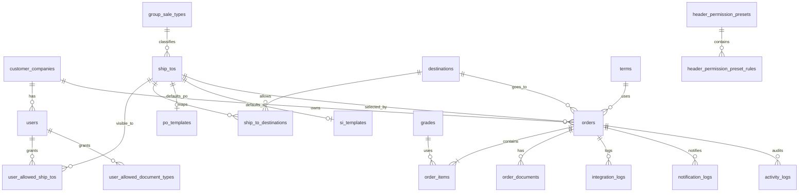

# Database Schema

This file defines the recommended relational schema for moving the current MVP
into a backend-backed project.

It is intentionally vendor-neutral so it can be implemented with:

- PostgreSQL
- MySQL
- SQL Server
- Prisma on top of any relational database

If the next project will use SQL Server and should follow SQL Server naming best
practice for physical table and column names, read
`database/DATABASE-SCHEMA-SQLSERVER.md` together with this file.

## Scope

The current MVP stores everything in local state and localStorage. For the next
project, the recommended persistence model is a normalized relational schema
with clear separation between:

- master data
- users and access rules
- order workflow transactions
- generated documents
- logs and notifications
- workflow permission presets

## Design Principles

- Use normalized tables for master/reference data.
- Keep workflow state on `orders` because one header now equals one PO.
- Use `order_items` for product-detail rows only.
- Store uploaded/generated workflow documents separately from the header.
- Use junction tables for multi-value user access and ship-to destinations.
- Keep audit logs append-only.
- Enforce one active document per type per header with a unique constraint.

## Recommended Enums

### `role`

- `UBE_JAPAN`
- `MAIN_TRADER`
- `CS`
- `SALE`
- `SALE_MANAGER`
- `ADMIN`

### `user_group`

- `TRADER`
- `UEC_SALE`
- `TSL_SALE`
- `UEC_MANAGER`
- `TSL_CS`
- `ADMIN`

### `order_header_status`

- `DRAFT`
- `CREATED`
- `APPROVED`
- `WAIT_SALE_UEC_APPROVE_PO`
- `WAIT_MGR_UEC_APPROVE_PO`
- `VESSEL_SCHEDULED`
- `VESSEL_DEPARTED`

### `document_type`

- `Shipping Document`
- `BL`
- `Invoice`
- `COA`
- `PO_PDF`
- `SHIPPING_INSTRUCTION_PDF`

### `header_action`

- Legacy action codes may keep their existing names for compatibility, but they
  operate on the header.
- `SUBMIT_LINE`
- `APPROVE_LINE`
- `SET_ETD`
- `APPROVE_SALE_PO`
- `APPROVE_MGR_PO`
- `UPLOAD_FINAL_DOCS`

### `group_sale_type`

- `OVERSEAS`
- `DOMESTIC`

### `notification_type`

- `email`
- `system`

### `integration_status`

- `SUCCESS`
- `FAILED`
- `PENDING`

## Tables

## 1. Reference And Access Tables

### `customer_companies`

| Column       | Type     | Null | Notes                   |
| ------------ | -------- | ---- | ----------------------- |
| `id`         | string   | No   | PK, stable company code |
| `name`       | string   | No   | Company display name    |
| `created_at` | datetime | No   | Audit timestamp         |
| `updated_at` | datetime | No   | Audit timestamp         |

### `users`

| Column                | Type              | Null | Notes                          |
| --------------------- | ----------------- | ---- | ------------------------------ |
| `id`                  | string            | No   | PK                             |
| `username`            | string            | No   | Unique login identifier        |
| `role`                | enum `role`       | No   | Route-level access             |
| `user_group`          | enum `user_group` | No   | Action-level access            |
| `company_id`          | string            | No   | FK -> `customer_companies.id`  |
| `can_create_order`    | boolean           | No   | Create-order permission        |
| `ship_to_access_mode` | string            | No   | `ALL` or `SELECTED`            |
| `is_active`           | boolean           | No   | Recommended for future backend |
| `created_at`          | datetime          | No   | Audit timestamp                |
| `updated_at`          | datetime          | No   | Audit timestamp                |

### `user_allowed_ship_tos`

Use only when a user is in `SELECTED` ship-to mode.

| Column       | Type   | Null | Notes               |
| ------------ | ------ | ---- | ------------------- |
| `user_id`    | string | No   | FK -> `users.id`    |
| `ship_to_id` | string | No   | FK -> `ship_tos.id` |

Unique key: `(user_id, ship_to_id)`

### `user_allowed_document_types`

| Column          | Type                 | Null | Notes                 |
| --------------- | -------------------- | ---- | --------------------- |
| `user_id`       | string               | No   | FK -> `users.id`      |
| `document_type` | enum `document_type` | No   | Allowed document type |

Unique key: `(user_id, document_type)`

## 2. Master Data Tables

### `group_sale_types`

| Column | Type                   | Null | Notes        |
| ------ | ---------------------- | ---- | ------------ |
| `id`   | enum `group_sale_type` | No   | PK           |
| `name` | string                 | No   | Display name |

### `destinations`

| Column       | Type     | Null | Notes           |
| ------------ | -------- | ---- | --------------- |
| `id`         | string   | No   | PK              |
| `name`       | string   | No   | Display name    |
| `created_at` | datetime | No   | Audit timestamp |
| `updated_at` | datetime | No   | Audit timestamp |

### `terms`

| Column       | Type     | Null | Notes           |
| ------------ | -------- | ---- | --------------- |
| `id`         | string   | No   | PK              |
| `name`       | string   | No   | Display name    |
| `created_at` | datetime | No   | Audit timestamp |
| `updated_at` | datetime | No   | Audit timestamp |

### `grades`

| Column       | Type     | Null | Notes           |
| ------------ | -------- | ---- | --------------- |
| `id`         | string   | No   | PK              |
| `name`       | string   | No   | Display name    |
| `created_at` | datetime | No   | Audit timestamp |
| `updated_at` | datetime | No   | Audit timestamp |

### `ship_tos`

| Column               | Type                   | Null | Notes                       |
| -------------------- | ---------------------- | ---- | --------------------------- |
| `id`                 | string                 | No   | PK                          |
| `name`               | string                 | No   | Display name                |
| `group_sale_type_id` | enum `group_sale_type` | No   | FK -> `group_sale_types.id` |
| `created_at`         | datetime               | No   | Audit timestamp             |
| `updated_at`         | datetime               | No   | Audit timestamp             |

### `ship_to_destinations`

| Column           | Type   | Null | Notes                   |
| ---------------- | ------ | ---- | ----------------------- |
| `ship_to_id`     | string | No   | FK -> `ship_tos.id`     |
| `destination_id` | string | No   | FK -> `destinations.id` |

Unique key: `(ship_to_id, destination_id)`

### `po_templates`

| Column                 | Type     | Null | Notes                             |
| ---------------------- | -------- | ---- | --------------------------------- |
| `id`                   | string   | No   | PK                                |
| `ship_to_id`           | string   | No   | Unique FK -> `ship_tos.id`        |
| `to_block`             | text     | No   | Multi-line TO block               |
| `consignee_notify`     | text     | No   | Multi-line consignee/notify block |
| `agent`                | text     | Yes  | Agent text                        |
| `end_user`             | text     | Yes  | End-user text                     |
| `terms_of_payment`     | text     | Yes  | Terms of payment                  |
| `packing_instructions` | text     | Yes  | Packing instructions              |
| `confirm_by`           | text     | Yes  | Signatory block                   |
| `created_at`           | datetime | No   | Audit timestamp                   |
| `updated_at`           | datetime | No   | Audit timestamp                   |

Recommended unique key: `(ship_to_id)`

### `si_templates`

| Column                 | Type     | Null | Notes                      |
| ---------------------- | -------- | ---- | -------------------------- |
| `id`                   | string   | No   | PK                         |
| `ship_to_id`           | string   | No   | Unique FK -> `ship_tos.id` |
| `attn`                 | text     | Yes  | ATTN block                 |
| `from_block`           | text     | Yes  | FROM block                 |
| `po_number_header`     | text     | Yes  | PO label                   |
| `no2_header`           | text     | Yes  | Secondary label            |
| `no2`                  | text     | Yes  | Secondary value            |
| `material_code_header` | text     | Yes  | Material code label        |
| `material_code`        | text     | Yes  | Material code value        |
| `note_under_material`  | text     | Yes  | Material note              |
| `user_text`            | text     | Yes  | User section               |
| `country`              | text     | Yes  | Country section            |
| `shipper`              | text     | Yes  | Shipper section            |
| `feeder_vessel`        | text     | Yes  | Default feeder vessel      |
| `mother_vessel`        | text     | Yes  | Default mother vessel      |
| `vessel_company`       | text     | Yes  | Default vessel company     |
| `forwarder`            | text     | Yes  | Default forwarder          |
| `port_of_loading`      | text     | Yes  | Port of loading            |
| `consignee`            | text     | Yes  | Consignee block            |
| `bl_type`              | text     | Yes  | BL type                    |
| `free_time`            | text     | Yes  | Free time                  |
| `courier_address`      | text     | Yes  | Courier address            |
| `eori_no`              | text     | Yes  | EORI number                |
| `booking_no`           | text     | Yes  | Booking number             |
| `notify_party`         | text     | Yes  | Notify party               |
| `also_notify_1`        | text     | Yes  | Additional notify line 1   |
| `also_notify_2`        | text     | Yes  | Additional notify line 2   |
| `deliver_to`           | text     | Yes  | Deliver-to block           |
| `requirements`         | text     | Yes  | Requirements block         |
| `note`                 | text     | Yes  | Note line 1                |
| `note2`                | text     | Yes  | Note line 2                |
| `note3`                | text     | Yes  | Note line 3                |
| `description`          | text     | Yes  | Description section        |
| `under_description`    | text     | Yes  | Under-description text     |
| `shipping_mark`        | text     | Yes  | Multi-line shipping mark   |
| `below_signature`      | text     | Yes  | Footer note                |
| `created_at`           | datetime | No   | Audit timestamp            |
| `updated_at`           | datetime | No   | Audit timestamp            |

Recommended unique key: `(ship_to_id)`

## 3. Workflow Tables

### `orders`

One row represents one PO header.

| Column              | Type                       | Null | Notes                               |
| ------------------- | -------------------------- | ---- | ----------------------------------- |
| `id`                | string                     | No   | PK                                  |
| `po_no`             | string                     | No   | Unique business PO number           |
| `order_date`        | date or datetime           | No   | Header date                         |
| `company_id`        | string                     | No   | FK -> `customer_companies.id`       |
| `ship_to_id`        | string                     | No   | FK -> `ship_tos.id`                 |
| `destination_id`    | string                     | No   | FK -> `destinations.id`             |
| `term_id`           | string                     | No   | FK -> `terms.id`                    |
| `status`            | enum `order_header_status` | No   | Canonical workflow status           |
| `request_etd`       | date                       | Yes  | Requested ETD                       |
| `request_eta`       | date                       | Yes  | Requested ETA                       |
| `price`             | decimal                    | Yes  | Price assigned during sale approval |
| `currency`          | string                     | Yes  | Currency code                       |
| `other_requested`   | text                       | Yes  | Optional free text                  |
| `sale_note`         | text                       | Yes  | Commercial note                     |
| `quotation_no`      | string                     | Yes  | CRM quotation number                |
| `asap`              | boolean                    | No   | Urgency flag                        |
| `actual_etd`        | date                       | Yes  | Final ETD set by CS                 |
| `clearance_date`    | date                       | Yes  | Optional clearance date             |
| `feeder_vessel`     | text                       | Yes  | Vessel detail                       |
| `mother_vessel`     | text                       | Yes  | Vessel detail                       |
| `vessel_company`    | text                       | Yes  | Vessel detail                       |
| `forwarder`         | text                       | Yes  | Forwarder detail                    |
| `vessel_etd`        | date                       | Yes  | Optional vessel ETD                 |
| `vessel_eta`        | date                       | Yes  | Optional vessel ETA                 |
| `note`              | text                       | Yes  | Header note                         |
| `pdf_snapshot_json` | json/text                  | Yes  | Persisted PO/SI snapshot data       |
| `created_by`        | string                     | No   | Username or FK -> `users.id`        |
| `updated_by`        | string                     | No   | Username or FK -> `users.id`        |
| `created_at`        | datetime                   | No   | Audit timestamp                     |
| `updated_at`        | datetime                   | No   | Audit timestamp                     |

Recommended unique key: `(po_no)`

### `order_items`

Child rows are product-detail rows only.

| Column         | Type     | Null | Notes                               |
| -------------- | -------- | ---- | ----------------------------------- |
| `id`           | string   | No   | PK                                  |
| `order_id`     | string   | No   | FK -> `orders.id`                   |
| `line_no`      | integer  | No   | Sequence within the PO header       |
| `product_id`   | string   | Yes  | Optional FK to future product table |
| `grade_id`     | string   | Yes  | FK -> `grades.id`                   |
| `product_name` | string   | Yes  | Optional display text               |
| `qty`          | decimal  | No   | Quantity                            |
| `unit`         | string   | Yes  | Optional unit of measure            |
| `remark`       | text     | Yes  | Product-specific note               |
| `created_at`   | datetime | No   | Audit timestamp                     |
| `updated_at`   | datetime | No   | Audit timestamp                     |

Recommended unique key: `(order_id, line_no)`

### `order_documents`

Primary workflow and shipment documents live on the header.

| Column        | Type                 | Null | Notes                        |
| ------------- | -------------------- | ---- | ---------------------------- |
| `id`          | string               | No   | PK                           |
| `order_id`    | string               | No   | FK -> `orders.id`            |
| `type`        | enum `document_type` | No   | Document type                |
| `filename`    | string               | No   | Filename                     |
| `storage_url` | text                 | Yes  | Storage location             |
| `data_url`    | long text            | Yes  | Optional MVP-compatible blob |
| `uploaded_by` | string               | No   | Username or FK -> `users.id` |
| `uploaded_at` | datetime             | No   | Audit timestamp              |

Recommended unique key: `(order_id, type)`

### `order_item_documents`

Optional table only if the next project later introduces product-line-specific
attachments.

| Column          | Type                 | Null | Notes                        |
| --------------- | -------------------- | ---- | ---------------------------- |
| `id`            | string               | No   | PK                           |
| `order_item_id` | string               | No   | FK -> `order_items.id`       |
| `type`          | enum `document_type` | No   | Document type                |
| `filename`      | string               | No   | Filename                     |
| `storage_url`   | text                 | Yes  | Storage location             |
| `uploaded_by`   | string               | No   | Username or FK -> `users.id` |
| `uploaded_at`   | datetime             | No   | Audit timestamp              |

## 4. Workflow Permission Tables

### `header_action_permissions`

Stores the live workflow matrix for PO headers.

| Column               | Type                       | Null | Notes                     |
| -------------------- | -------------------------- | ---- | ------------------------- |
| `action`             | enum `header_action`       | No   | Part of logical key       |
| `from_status`        | enum `order_header_status` | No   | Part of logical key       |
| `to_status`          | enum `order_header_status` | No   | Target status             |
| `allowed_user_group` | enum `user_group`          | No   | One row per allowed group |

Recommended unique key: `(action, from_status, allowed_user_group)`

### `header_permission_presets`

| Column       | Type     | Null | Notes                      |
| ------------ | -------- | ---- | -------------------------- |
| `id`         | string   | No   | PK                         |
| `name`       | string   | No   | Preset name, unique        |
| `is_system`  | boolean  | No   | True for STANDARD / STRICT |
| `created_at` | datetime | No   | Audit timestamp            |
| `updated_at` | datetime | No   | Audit timestamp            |

### `header_permission_preset_rules`

| Column               | Type                       | Null | Notes                                |
| -------------------- | -------------------------- | ---- | ------------------------------------ |
| `preset_id`          | string                     | No   | FK -> `header_permission_presets.id` |
| `action`             | enum `header_action`       | No   | Rule action                          |
| `from_status`        | enum `order_header_status` | No   | Rule source status                   |
| `to_status`          | enum `order_header_status` | No   | Rule target status                   |
| `allowed_user_group` | enum `user_group`          | No   | Allowed group                        |

Recommended unique key: `(preset_id, action, from_status, allowed_user_group)`

### `app_settings`

Recommended minimal settings table for values currently kept in store state.

| Column       | Type      | Null | Notes                       |
| ------------ | --------- | ---- | --------------------------- |
| `key`        | string    | No   | PK                          |
| `value_json` | json/text | No   | Flexible serialized setting |

Required settings in the next project:

- `headerPermissionLocked`
- optional `activeHeaderPermissionPresetId`

## 5. Audit And Communication Tables

### `integration_logs`

| Column             | Type                      | Null | Notes             |
| ------------------ | ------------------------- | ---- | ----------------- |
| `id`               | string                    | No   | PK                |
| `order_id`         | string                    | No   | FK -> `orders.id` |
| `integration_type` | string                    | No   | Example: CRM      |
| `status`           | enum `integration_status` | No   | Integration state |
| `message`          | text                      | No   | Log message       |
| `timestamp`        | datetime                  | No   | Event timestamp   |

### `notification_logs`

| Column       | Type                     | Null | Notes                             |
| ------------ | ------------------------ | ---- | --------------------------------- |
| `id`         | string                   | No   | PK                                |
| `order_id`   | string                   | Yes  | FK -> `orders.id` when applicable |
| `message`    | text                     | No   | Notification body                 |
| `timestamp`  | datetime                 | No   | Event timestamp                   |
| `role`       | enum `role`              | No   | Target role                       |
| `type`       | enum `notification_type` | No   | `email` or `system`               |
| `event_name` | string                   | No   | Workflow or save/edit event name  |

### `activity_logs`

| Column      | Type     | Null | Notes                               |
| ----------- | -------- | ---- | ----------------------------------- |
| `id`        | string   | No   | PK                                  |
| `order_id`  | string   | Yes  | FK -> `orders.id` when applicable   |
| `category`  | string   | No   | `WORKFLOW`, `EDIT`, `DOCUMENT`, etc |
| `action`    | string   | No   | Action label                        |
| `user_name` | string   | No   | Actor username or system label      |
| `timestamp` | datetime | No   | Event timestamp                     |
| `details`   | text     | No   | Human-readable details              |

## Constraints Summary

- `users.username` unique
- `orders.po_no` unique
- `order_items (order_id, line_no)` unique
- `order_documents (order_id, type)` unique
- `po_templates.ship_to_id` unique
- `si_templates.ship_to_id` unique
- `ship_to_destinations (ship_to_id, destination_id)` unique
- `user_allowed_ship_tos (user_id, ship_to_id)` unique
- `user_allowed_document_types (user_id, document_type)` unique
- `header_permission_presets.name` unique

## Recommended Indexes

- `orders(company_id, order_date desc)`
- `orders(ship_to_id, updated_at desc)`
- `orders(status, updated_at desc)`
- `order_items(order_id)`
- `order_items(grade_id)`
- `order_documents(order_id)`
- `integration_logs(order_id, timestamp desc)`
- `notification_logs(role, timestamp desc)`
- `activity_logs(category, timestamp desc)`
- `header_action_permissions(from_status, action)`

## Derived Values

The following values may be stored as snapshots for performance, but the source
of truth should remain relational data:

- dashboard counts by header status
- `orders.pdf_snapshot_json` for reproducing generated PDFs

## Mermaid ERD

## AI Implementation Notes

- Implement workflow at the header level.
- Do not reintroduce a derived order-progress status layer above the PO header.
- Keep document replacement semantics by type at the header level.
- Normalize `allowedShipToIds` and `allowedDocumentTypes` into junction tables.
- Keep templates data-driven so PDF content can be changed without redeploying.
- Use `database/schema.prisma.example` in this docs pack when the next project
  needs a concrete Prisma starting point instead of a prose schema description.

## Read Next

- For the current runtime `Order` object shape, read
  `requirements/domain/ORDER-STRUCTURE.md`.
- For SQL Server physical naming, read `database/DATABASE-SCHEMA-SQLSERVER.md`.
- For the functional workflow rules, read
  `requirements/workflow/WORKFLOW-AND-PERMISSIONS.md`.
- For master/reference data ownership and relationships, read
  `requirements/domain/MASTER-DATA-REFERENCE.md`.
- For the concrete Prisma model draft, read `database/schema.prisma.example`.
